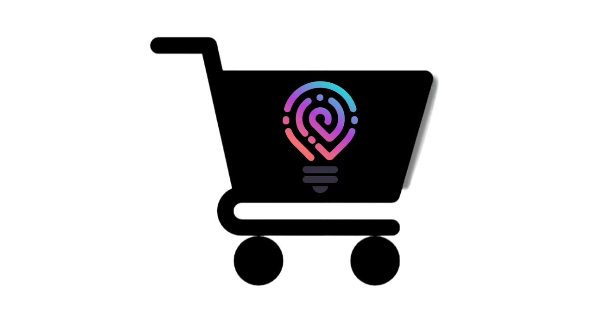

# Fusion Shop - E-Commerce Mobile



Este é um projeto em grupo desenvolvido como parte do programa da **Imã Tech** em colaboração com a **Novo Mundo**. O projeto, chamado **Todas Tech**, é uma formação full-stack exclusivamente para mulheres, com foco em criar um aplicativo de e-commerce mobile para produtos de tecnologia. Nós, a equipe **Code Fusion**, desenvolvemos o aplicativo que se chama **Fusion Shop**, incluindo sua identidade visual.

## Tecnologias Utilizadas

- **Front-end:** Dart e Flutter
- **Back-end:** PHP e Laravel

## Tasks Desenvolvidas

### Tela Inicial - Home

A primeira tarefa concluída foi a criação da tela inicial - Home do Fusion Shop. Nesta tela, atendemos aos seguintes requisitos:

- [x] Listar 3 categorias principais:
    - [x] Eletroeletrônicos
    - [x] Smartphones
    - [x] SmartTVs
- [x] Listagem de produtos.
- [x] Menu de navegação (Tab Navigation Bottom)


### Como Executar o Projeto

Para executar o projeto em seu ambiente local, siga as etapas abaixo:

**Front-end (Dart e Flutter):**

1. **Clone o Repositório:**

   ```bash
   git clone code-fusion-ima/hackadev.git

2.Navegue até o Diretório do Projeto:

cd nome-do-repositorio

3.Instale as Dependências:

flutter pub get


4.Execute o Aplicativo:

flutter run


### Contribuidoras
- [Brunna Gualberto](URL-do-LinkedIn)
- [Danúbia Ferreira](https://www.linkedin.com/in/dancarvalho09/)
- [Débora Barbosa](https://www.linkedin.com/in/debora--barbosa/)
- [Denise Schirmer](URL-do-LinkedIn)
- [Janine Oliveira](https://www.linkedin.com/in/janine-de-oliveira/)
- [Jordana Carneiro](http://linkedin.com/in/jordana-alves-carneiro-774879161/)
- [Luana Souza](https://www.linkedin.com/in/luana-souza-dev/)
- [Sarah Silva](https://www.linkedin.com/in/sarah-rayssa/)
- [Tahene Carvalho](https://www.linkedin.com/in/tahene-carvalho-4492bb228/)
- [Viviane Canuto](https://www.linkedin.com/in/viviane-canuto-a14274212/)

### Contato

Para obter mais informações sobre o projeto ou entrar em contato com a equipe, você pode nos encontrar no LinkedIn ou enviar um e-mail para [endereço-de-email@exemplo.com](mailto:endereço-de-email@exemplo.com).

### Sobre o Projeto

Este projeto é parte do programa da **Imã Tech** em colaboração com a **Novo Mundo**. Agradecemos pelo apoio e pela oportunidade de participar deste programa incrível! 🚀🌟


