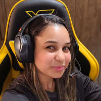
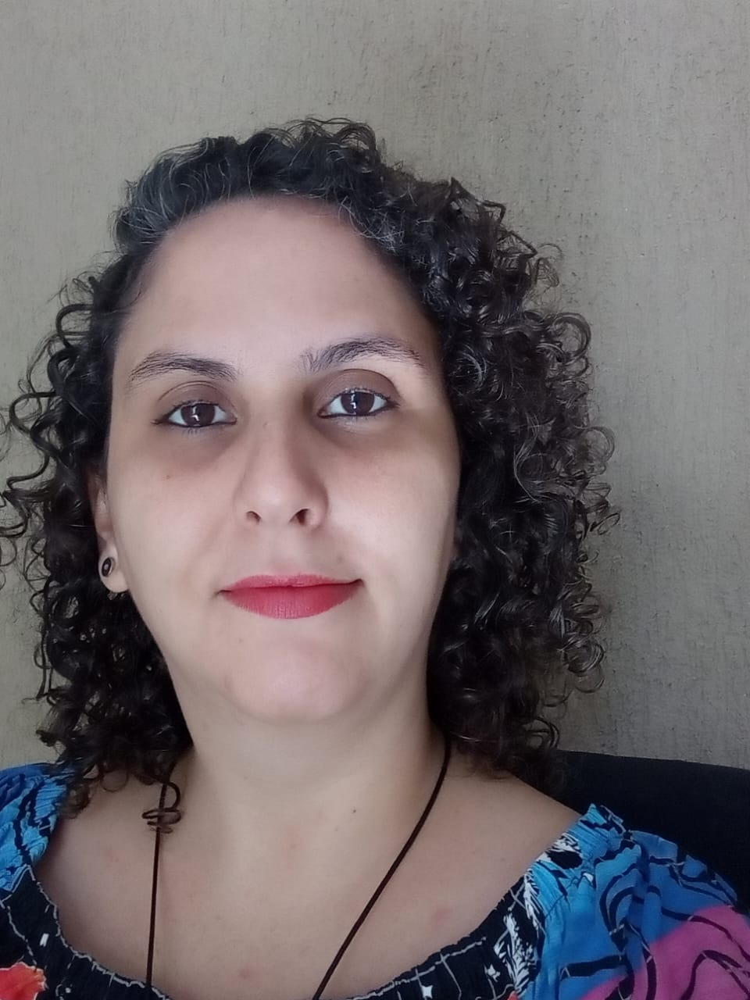

# Fusion Shop - E-Commerce Mobile ⌛


Este é um projeto em grupo desenvolvido como parte do programa da **Imã Tech** em colaboração com a **Novo Mundo**. O projeto, chamado **Todas Tech**, é uma formação full-stack exclusivamente para mulheres, com foco em criar um aplicativo de e-commerce mobile para produtos de tecnologia. Nós, a equipe **Code Fusion**, desenvolvemos o aplicativo que se chama **Fusion Shop**, incluindo sua identidade visual.

## Tecnologias Utilizadas

- **Front-end:** Dart e Flutter
- **Back-end:** PHP e Laravel

## Tasks Desenvolvidas

### Tela Inicial - Home

A primeira tarefa concluída foi a criação da tela inicial - Home do Fusion Shop. Nesta tela, atendemos aos seguintes requisitos:

- [x] Listar 3 categorias principais:
    - [x] Eletroeletrônicos
    - [x] Smartphones
    - [x] SmartTVs
- [x] Listagem de produtos.
- [x] Menu de navegação (Tab Navigation Bottom)


### Como Executar o Projeto

Para executar o projeto em seu ambiente local, siga as etapas abaixo:

**Front-end (Dart e Flutter):**

1. **Clone o Repositório:**

   ```bash
    git clone code-fusion-ima/hackadev.git

2. **Navegue até o Diretório do Projeto:**
    
    ```bash
    cd hackadev

3. **Instale as Dependências:**

    ```bash
    flutter pub get

4. **Execute o Aplicativo:**

    ```bash
    flutter run

### Desenvolvedoras

|  |  |  |  |
| ---------------- | ---------------- | ---------------- | ---------------- |
| | |  |
| |💻  <a href="https://www.linkedin.com/in/luana-souza-dev/" >Luana Souza</a> 🎧<br>Monitoria da equipe | 💻 <a href="https://www.linkedin.com/in/janine-de-oliveira/">Janine Oliveira </a>🎧<br>Monitoria da equipe |
|  |  |  | |
|💻<a href="">Brunna Gualberto</a>🎧| 💻 <a href="https://www.linkedin.com/in/debora--barbosa/">Débora Barbosa</a>🎧 | 💻 <a href="#">Denise Schirmer</a>🎧 | 💻<a href="https://www.linkedin.com/in/dancarvalho09/"> Danúbia Ferreira</a>🎧 |
|  |   | |  |
| 💻<a href="http://linkedin.com/in/jordana-alves-carneiro-774879161/">Jordana Carneiro</a>🎧 | 💻 <a href="https://www.linkedin.com/in/sarah-rayssa/">Sarah Rayssa</a>🎧 |💻  <a href="https://www.linkedin.com/in/tahene-carvalho-4492bb228/">Tahene Carvalho</a>🎧  | 💻  <a href="https://www.linkedin.com/in/viviane-canuto-a14274212/"> Viviane Canuto</a>🎧 | 
||||


### Contato

Para obter mais informações sobre o projeto ou entrar em contato com a equipe, você pode nos encontrar no LinkedIn ou enviar um e-mail para [codefusion.ima@gmail.com](mailto:endereço-de-email@exemplo.com).

### Sobre o Projeto

Este projeto faz parte da iniciativa da **Imã Tech**, em parceria com a **Novo Mundo**, que oferece uma formação 100% gratuita em Tecnologia para mulheres. Agradecemos imensamente pelo apoio e pela oportunidade de participar deste programa extraordinário!🚀🌟


